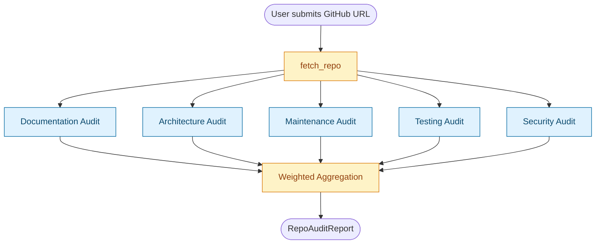

# Repolens

> Agentic AI system that audits any GitHub repository across architecture, security, documentation, maintenance, and testing dimensions.

[](https://github.com/Haichennn/repolens/actions/workflows/ci.yml)

## Live Demo

**Try it live:** [repolens-audit.vercel.app](https://repolens-audit.vercel.app)

Paste any GitHub repo URL, watch five AI agents audit it in parallel, drill into any score for findings and recommendations.

**Production API**: https://repolens-production-61e0.up.railway.app

Try it now:
- [`/`](https://repolens-production-61e0.up.railway.app/) — service info
- [`/health`](https://repolens-production-61e0.up.railway.app/health) — health check
- [`/status`](https://repolens-production-61e0.up.railway.app/status) — runtime configuration
- [`/audit?repo_url=https://github.com/Haichennn/repolens`](https://repolens-production-61e0.up.railway.app/audit?repo_url=https://github.com/Haichennn/repolens) — full audit of this repo (takes ~30s)
- [`/docs`](https://repolens-production-61e0.up.railway.app/docs) — interactive API documentation

Or via curl:

```bash
curl "https://repolens-production-61e0.up.railway.app/audit?repo_url=https://github.com/fastapi/fastapi"
```

## Structure

This repo is a monorepo with two components:

```
repolens/
├── backend/        Python · FastAPI · LangGraph · MCP server (Anthropic Model Context Protocol)
└── frontend/       Next.js · TypeScript · Tailwind · shadcn/ui
```

backend is deployed on Railway via Docker: https://repolens-production-61e0.up.railway.app
frontend is deployed on Vercel (see Live Demo above)

Each can be developed independently. The frontend calls the backend's `/audit` endpoint over HTTPS.

## Quick Start

### Prerequisites

- Python 3.12+
- Node.js 20+
- An Anthropic API key ([console.anthropic.com](https://console.anthropic.com))
- A GitHub personal access token ([github.com/settings/tokens](https://github.com/settings/tokens))

### Local development

```bash
# Clone
git clone https://github.com/Haichennn/repolens.git
cd repolens

# Backend
cd backend
python3 -m venv venv
source venv/bin/activate
pip install -r requirements.txt
cp .env.example .env  # Add your ANTHROPIC_API_KEY and GITHUB_TOKEN
uvicorn api.main:app --reload --port 8000

# Frontend (in a new terminal)
cd ../frontend
npm install
echo "NEXT_PUBLIC_API_BASE=http://localhost:8000" > .env.local
npm run dev
```

Open http://localhost:3000 and paste any GitHub URL.

### Production deployment

- Backend deploys to Railway from `/backend/Dockerfile`
- Frontend deploys to Vercel from `/frontend` (Next.js auto-detected)
- See `/backend/Dockerfile` and `/frontend/next.config.ts` for build details

## Example Audit Output

Running Repolens against its own repository (dogfooding):

```json
{
  "owner": "Haichennn",
  "repo_name": "repolens",
  "overall_score": 62,
  "overall_severity": "warning",
  "documentation": { "score": 42, "severity": "warning" },
  "architecture":  { "score": 72, "severity": "good" },
  "maintenance":   { "score": 62, "severity": "warning" },
  "testing":       { "score": 42, "severity": "warning" },
  "security":      { "score": 78, "severity": "good" }
}
```

The Security audit flagged unpinned dependencies; the Testing audit correctly identified an empty tests/ folder; the Architecture audit recognized the new Dockerfile and bumped the score. *The tool surfaces real issues in its own codebase.*

---

**Status**: 🚧 In active development (May - June 2026)

Stack: LangGraph (orchestration), LangChain (structured output), MCP (CVE database tools), FastAPI (backend), Next.js (frontend), Anthropic API.

## Architecture



> Built with LangGraph (state-passing graph orchestration), LangChain (structured output via `with_structured_output`), Pydantic schemas, and a custom MCP server exposing CVE database + package registry tools to the Security audit sub-agent.

## License

MIT
